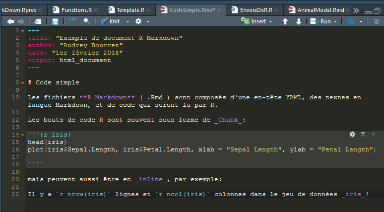
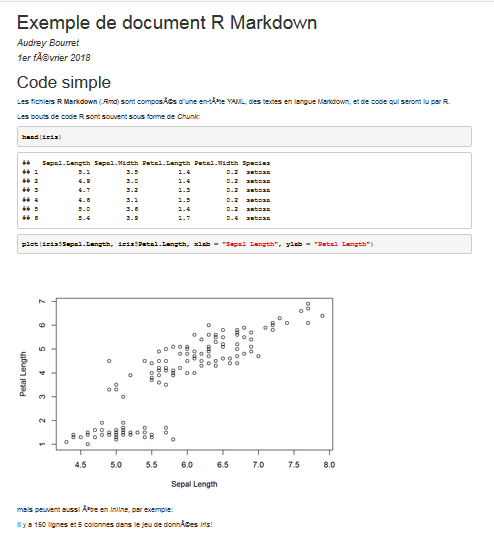
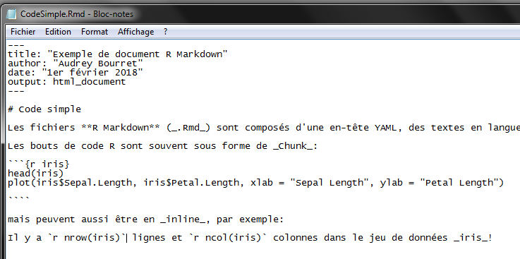
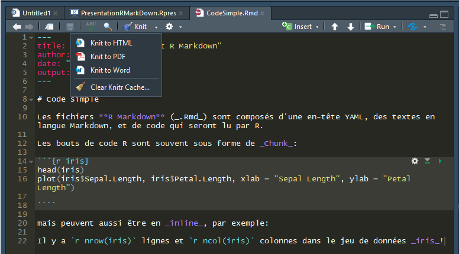
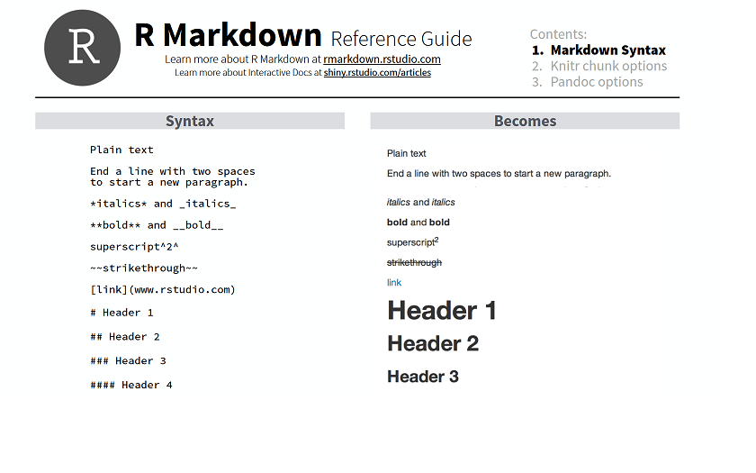
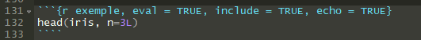
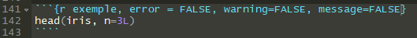
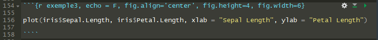

## De quoi parle-t-on?

Produire un document (_output_) **html**, **PDF**, **word** etc. qui inclue des parties de texte qui peuvent être formattées, et des bouts de codes R (ou autre), le tout à partir d'un document de type **Rmd** dans R.  

**_Cette dispositive en est un bon exemple!_**

Données _iris_:

```{r}
head(iris, n=3L)
````


## Pourquoi utiliser R Markdown?

- Arrêter de faire du copier-coller entre R et un autre document!
- Envoyer des résultats à un collaborateur
- Collaborer plus facilement sur un code 
- Pouvoir mettre à jour des rapports plus rapidement


## R Markdown = Markdown + R


**Markdown** : Language **_de balisage léger_** (!!), avec une syntaxe facile à lire et à écrire. 

**.md** &rarr; **.html** (&rarr; **.doc** / **.pdf**)

Par exemple, mettre _un mot_ en italique:

```{r, eval = F}
html : <i>un mot</i>

laTeX: \textit{un mot}

markdown: _un mot_
```


## R Markdown = Markdown + R

**R Markdown** : Document Markdown, mais avec des "_chunk_" (bout) de code R intégrés

**.Rmd** &rarr; **.md** &rarr; **.html** (&rarr; **.doc** / **.pdf**)  

**.Rmd** &rarr; **.R**


## Quelques pré-requis

**Pandoc**:  Convertiseur de fichiers universel

- Si vous utilisez Rstudio: inclus!

- Si vous utilisez directement la console R: il faut probablement l'installer 
http://pandoc.org/installing.html

```{r, eval = F}
library (rmarkdown)
rmarkdown::pandoc_available() # If TRUE, OK! 
```

**Packages** `rmarkdown` & `knitr`
```{r, eval = F}
install.packages("rmarkdown")
install.packages("knitr")
```


## Vu d'ensemble d'un code RMarkDown



## Ce que ça donne en html




## Exercice #1a

Créer un fichier .Rmd dans un éditeur de texte (p.ex. NotePad), avec une section d'en-tête, un bout de texte Markdown et un bout de code R.



## Exercice #1a - En-tête

```{}
---
output: html_document
---

---
output:
  html_document: default
  pdf_document: default (mais laTeX doit être installé)
---

---
output:
  html_document:
    theme: yeti
---

```

[Différents thèmes possibles](http://rmarkdown.rstudio.com/html_document_format.html#appearance_and_style)

## Exercice #1a - En-tête

Autres options:
```{}
---
title: "Avancement de mon projet"
author: "Audrey Bourret"
date: "31 janvier 2018"
output:
  html_document:
    theme: yeti
---
```


## Exercice #1a - Texte et code

```{}
---
output: html_document
---

# Intro
Voici le jeu de donnée que je vais utiliser:

|```{r}
|head(iris)
|````

```

Ne pas mettre les "|" !  
Enregistrer le document en _.Rmd_


## Exercice #1b


Ouvrir une console R, et transformer le fichier .Rmd en .html, .md et .R

```{r, eval=FALSE}
library(knitr)
library(rmarkdown)

# Répertoire de travail  = endroit où les fichiers .Rmd sont...
setwd("C:/Users/Audrey/Documents/CSBQ/Ateliers/H2018/RMarkDown")

# .Rmd --> .html
rmarkdown::render("CodeSimple.Rmd") # .html

# .Rmd --> .md
knit("CodeSimple.Rmd") # .md

# .Rmd --> .R
purl("CodeSimple.Rmd") # .R
purl("CodeSimple.Rmd", output = " CodeSimple2.R", documentation = 2)

````


## Option #2: Directement dans Rstudio


File &rarr; New file &rarr; R Markdown

_À noter: le répertoire de travail est toujours celui où le fichier .Rmd est enregistré_




## Syntaxe de base de Markdown

```{r, eval=FALSE}
# Entête 1 (peut aller jusqu'à 6#)
_italique_
**gras**
équation: $ A = B + C $
> Citation

Liste
* A
* B
  + C

[lien](www.biodray.github.io)

```

## Syntaxe de base de Markdown

  


## Options des chunks

  

```{r exemple, eval = TRUE, include = TRUE, echo = TRUE}
head(iris, n=3L)
````

eval = FALSE : ne roule pas le code  
include = FALSE : roule le code, mais montre ni le code, ni le résultat  
echo = FALSE : roule le code mais montre seulement le résultat

Il peut être pratique de donner un nom à chaque chunk (ici _exemple_)

## Options des chunks

  

```{r exemple2, error = FALSE, warning=FALSE, message=FALSE}
head(iris, n=3L)

````

L'option message est particulièrement utile lorsqu'on appele un package. 


## Options des chunks

  

```{r exemple3, echo = F, fig.align='center', fig.height=4, fig.width=6}

plot(iris$Sepal.Length, iris$Petal.Length, xlab = "Sepal Length", ylab = "Petal Length")

````


## Options des chunks

Il est possible de spécifier les valeurs par défault des options des chunks:

```{r setup, include=TRUE}
# Ajouter dans un chunck {r setup, include=FALSE} au début du projet!

knitr::opts_chunk$set(echo=TRUE, fig.align="center")

# "Note the global options set in one chunk will not affect the options in this chunk 
#  itself, and that is why we often need to set global options in a separate chunk."


```


Beaucoup d'autres options sont disponibles, voir les guides!

## Code directement dans le texte (_inline_)


## Astuces - Tableaux

```{r astuce1, error = FALSE, warning=FALSE, message=FALSE}
# Sans formattage
iris[1:2,]

# Avec formattage kable()
library(knitr)
kable(iris[1:2,])

````


## Ressources


http://rmarkdown.rstudio.com/


**Maintenant c'est à vous de jouer avec tout ça!**


