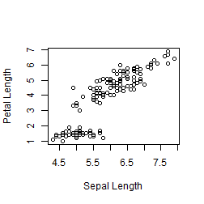

# Travailler avec R Markdown

### Objectifs de la rencontre

* Comprendre les avantages de travailler avec R Markdown
* S'initier au language Markdown et R Markdown
* Créer un fichier R Markdown (.Rmd), aliant à la fois textes et codes
* Transformer le fichier créé en document HTML/PDF

### Ce document a justement été créé avec R Markdown!

**R Markdown** permet de créer des documents où des sections de texte et de code sont intercallés, ce qui facilite le travail et la collaboration en science. Adieu les copier-coller entre la console R et un document Word!!!


```r
# Jeu de donnée iris
head(iris, n=3L)
```

```
##   Sepal.Length Sepal.Width Petal.Length Petal.Width Species
## 1          5.1         3.5          1.4         0.2  setosa
## 2          4.9         3.0          1.4         0.2  setosa
## 3          4.7         3.2          1.3         0.2  setosa
```

```r
# Créer un graphique
plot(iris$Sepal.Length, iris$Petal.Length, xlab = "Sepal Length", ylab = "Petal Length")
```



### Pré-requis à la rencontre

Avoir un portable avec R installé, c'est tout!

### Vous trouverez dans ce répertoire

* Les [deux fichiers exemples](https://github.com/biodray/IntroRMarkdown/tree/master/Materiel) utilisés lors de l'atelier
* Un lien vers [la présentation utilisée lors de l'atelier du 31 janvier 2018](https://github.com/biodray/IntroRMarkdown/tree/master/Presentation)
